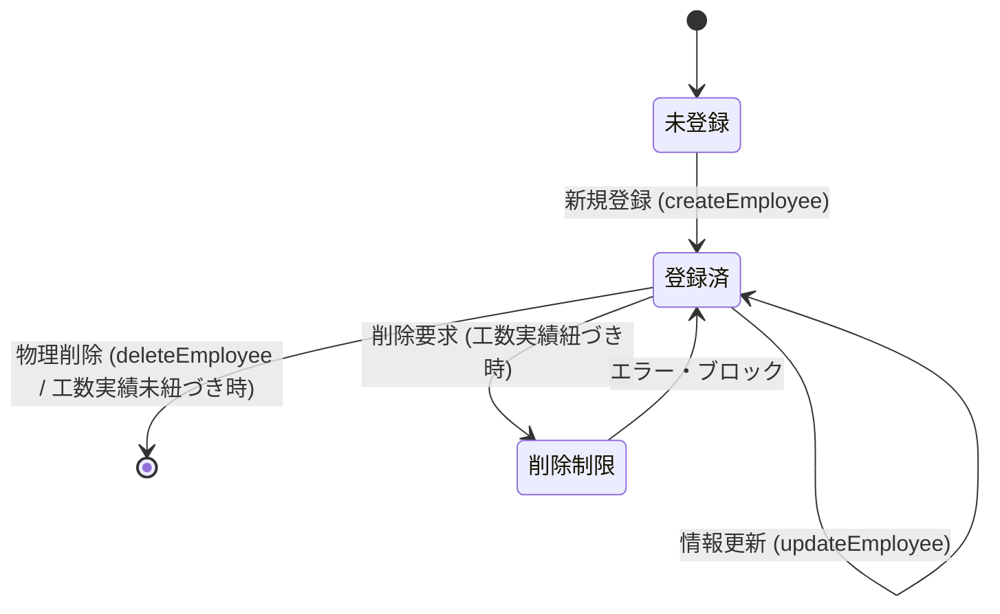

# Data Model: F02 社員マスタ管理

本ドキュメントは、「F02 社員マスタ管理」におけるエンティティ構造、制約ルール、および関連するデータ整合性の定義を記述する。

---

## 1. ドメインモデル & 属性 (Domain Model & Attributes)

### 集約ルート (Aggregate Root): `社員 (Employee)`
本システムにおいて、社員マスタ情報を表す不変的なドメイン集約。
憲法に則り、すべての属性は外部に対して読み取り専用 (`readonly`) とし、生成および変更（複製）はコンストラクタまたはエンティティメソッドを通じてのみ行う。

| 属性名 (論理) | プロパティ名 (物理) | 型 (TypeScript) | PK / UQ | バリデーション & 制約ルール |
| :--- | :--- | :--- | :---: | :--- |
| **社員ID** | `id` | `string` | PK | 形式: `EMPnnn` - `EMP` は固定プレフィックス - `nnn` は `001` から始まる連番。 - 最大 `EMP999` まで採番可能。 |
| **社員名** | `name` | `string` | - | 必須入力。 - 前後の半角・全角スペースは自動トリミングされる。 - トリミング後の文字長は `1` 文字以上 `255` 文字以下。 - 同姓同名（重複）の登録を許容する。 |
| **単価** | `costPerHours` | `number` | - | 必須入力。 - `0` 以上の整数値（負の値、小数は不可）。 - 上限値は `9,999,999` とする。 |

---

## 2. 状態・ライフサイクルとドメインアクション (Lifecycle Actions)

### 状態遷移図 (State Transition)

### ドメインアクションとビジネスルール
1. **新規作成 (Create)**:
   * 入力された `name` の前後スペースをトリミングし、バリデーションを行う。
   * 入力された `costPerHours` のバリデーション（0以上、整数）を行う。
   * リポジトリから自動採番された `EMPnnn` 形式の新規IDを取得し、`Employee` インスタンスを構築する。
2. **情報の変更 (Update)**:
   * 既存の社員インスタンスから、名前および単価を変更した**新しい社員インスタンスを生成（イミュータブル再構築）**してリポジトリに保存する。
   * 変更にあたっては新規作成と同様のバリデーションを適用する。
3. **物理削除 (Delete)**:
   * 工数実績データ（`月別案件社員工数` 等）に該当の `社員ID` が参照されているか検証し、存在する場合は削除処理を拒否して例外をスローする。
   * 参照されていない場合は、LocalStorageおよびインメモリデータストアから対象IDのレコードを物理削除する。
