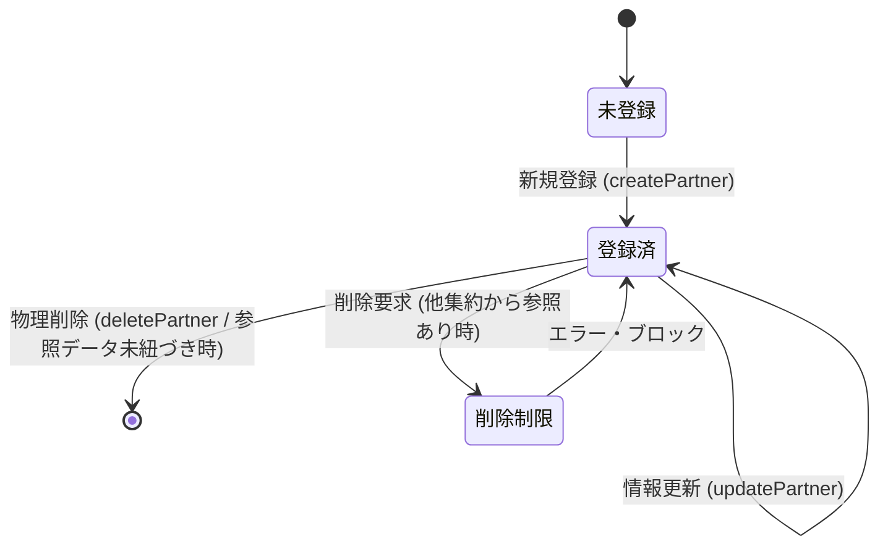

# Data Model: F03 発注先マスタ管理

本ドキュメントは、「F03 発注先マスタ管理」におけるエンティティ構造、制約ルール、および関連するデータ整合性の定義を記述する。

---

## 1. ドメインモデル & 属性 (Domain Model & Attributes)

### 集約ルート (Aggregate Root): `発注先 (Partner)`
本システムにおいて、パートナー企業（発注先マスタ）を表す不変的なドメイン集約。
不変性を保証するため、すべてのプロパティに `readonly` を付与し、生成および変更（複製）はコンストラクタを通じてのみ行う。

| 属性名 (論理) | プロパティ名 (物理) | 型 (TypeScript) | PK / UQ | バリデーション & 制約ルール |
| :--- | :--- | :--- | :---: | :--- |
| **発注先ID** | `id` | `string` | PK | 形式: `BPnnn` - `BP` は固定プレフィックス - `nnn` は `001` から始まる連番。 - 最大 `BP999` まで採番可能。 |
| **発注先名** | `name` | `string` | UQ1 | 必須入力。 - 前後の半角・全角スペースは自動トリミングされる。 - トリミング後の文字長は `1` 文字以上 `255` 文字以下。 - システム全体で一意（重複登録禁止）。 |

---

## 2. 状態・ライフサイクルとドメインアクション (Lifecycle Actions)

### 状態遷移図 (State Transition)

### ドメインアクションとビジネスルール
1. **新規作成 (Create)**:
   * 入力された `name` の前後スペースをトリミングし、バリデーションを行う。
   * アプリケーションサービス層で重複名チェックを行い、重複がない場合にリポジトリから自動採番された `BPnnn` 形式の新規IDを取得し、`Partner` インスタンスを構築する。
2. **情報の変更 (Update)**:
   * 既存の発注先インスタンスから、名前を変更した**新しい発注先インスタンスを生成（イミュータブル再構築）**して保存する。
   * アプリケーションサービス層で、自分以外のIDでの名前重複がないかを検証する。
3. **物理削除 (Delete)**:
   * 対象の発注先IDが `要員` マスタ（所属会社）または `発注` 実績データのいずれかに参照されているか検証し、存在する場合は削除を拒否し例外をスローする。
   * 参照されていない場合は、LocalStorageおよびメモリ内ストアから対象IDのレコードを物理削除する。
