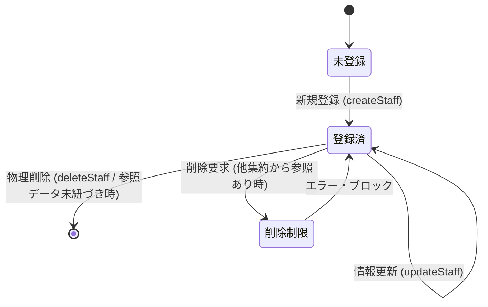

# Data Model: F04 要員マスタ管理

本ドキュメントは、「F04 要員マスタ管理」におけるエンティティ構造、制約ルール、および関連するデータ整合性の定義を記述する。

---

## 1. ドメインモデル & 属性 (Domain Model & Attributes)

### 集約ルート (Aggregate Root): `要員 (Staff)`
本システムにおいて、パートナー企業の要員を表す不変的なドメイン集約。
不変性を保証するため、すべてのプロパティに `readonly` を付与し、生成および変更（複製）はコンストラクタを通じてのみ行う。

| 属性名 (論理) | プロパティ名 (物理) | 型 (TypeScript) | PK / FK | バリデーション & 制約ルール |
| :--- | :--- | :--- | :---: | :--- |
| **要員ID** | `id` | `string` | PK | 形式: `MEMnnn` - `MEM` は固定プレフィックス - `nnn` は `001` から始まる連番。 - 最大 `MEM999` まで採番可能。 |
| **所属会社ID** | `partnerId` | `string` | FK | 必須入力。 - すでに登録されている有効な `発注先.発注先ID` でなければならない。 |
| **氏名** | `name` | `string` | - | 必須入力。 - 前後の半角・全角スペースは自動トリミングされる。 - トリミング後の文字長は `1` 文字以上 `255` 文字以下。 - 同姓同名の重複登録を許容する。 |
| **単価** | `costPerMonth` | `number` | - | 必須入力。 - `0` 以上の整数（負数はエラー）。 |

---

## 2. 状態・ライフサイクルとドメインアクション (Lifecycle Actions)

### 状態遷移図 (State Transition)

### ドメインアクションとビジネスルール
1. **新規作成 (Create)**:
   * 入力された `name` の前後スペースをトリミングし、単価 `costPerMonth` が 0 以上であることをバリデーションする。
   * 指定された `partnerId` がマスタ上に存在することを検証する。
   * リポジトリから自動採番された `MEMnnn` 形式の新規IDを取得し、`Staff` インスタンスを構築する。
2. **情報の変更 (Update)**:
   * 既存の要員インスタンスから、氏名・単価・所属会社を変更した**新しい要員インスタンスを生成（イミュータブル再構築）**して保存する。
   * 新規作成時と同様のバリデーションを実行する。
3. **物理削除 (Delete)**:
   * 対象の要員IDが `注文明細`（契約・注文実績）または `月別要員工数サマリ`（実績サマリ）のいずれかに参照されているか検証し、存在する場合は削除を拒否し例外をスローする。
   * 参照されていない場合は、LocalStorageおよびメモリ内ストアから対象IDのレコードを物理削除する。
