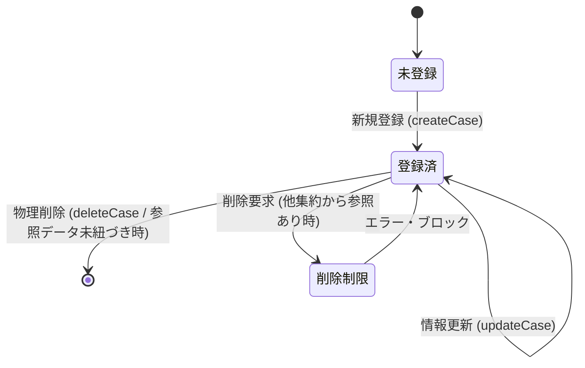

# Data Model: F05 案件管理

本ドキュメントは、「F05 案件管理」におけるエンティティ構造、制約ルール、および関連するデータ整合性の定義を記述する。

---

## 1. ドメインモデル & 属性 (Domain Model & Attributes)

### 集約ルート (Aggregate Root): `案件 (Case)`
プロジェクトに紐づく作業のまとまり（案件）を表す不変的なドメイン集約。
不変性を保証するため、すべてのプロパティに `readonly` を付与し、生成および変更（複製）はコンストラクタを通じてのみ行う。
本モデルは `projectId` と `id` の複合キーを主キーとする。

| 属性名 (論理) | プロパティ名 (物理) | 型 (TypeScript) | PK / FK | バリデーション & 制約ルール |
| :--- | :--- | :--- | :---: | :--- |
| **プロジェクトID** | `projectId` | `string` | PK, FK | 必須入力。 - すでに登録されている有効な `プロジェクト.プロジェクトID` でなければならない。 |
| **案件ID** | `id` | `string` | PK | 形式: `AJnnn` - `AJ` は固定プレフィックス - `nnn` は `001` から始まる連番。 - プロジェクト単位で個別に採番される。 - 最大 `AJ999` まで採番可能。 |
| **案件名** | `name` | `string` | - | 必須入力。 - 前後の半角・全角スペースは自動トリミングされる。 - トリミング後の文字長は `1` 文字以上 `255` 文字以下。 - 同一プロジェクト内での重複登録を禁止する。 |
| **開始日** | `startDate` | `string` | - | 必須入力。 - `YYYY-MM-DD` 形式の妥当な日付。 - `終了日` 以前でなければならない。 |
| **終了日** | `endDate` | `string` | - | 必須入力。 - `YYYY-MM-DD` 形式の妥当な日付。 - `開始日` 以降でなければならない。 |

---

## 2. 状態・ライフサイクルとドメインアクション (Lifecycle Actions)

### 状態遷移図 (State Transition)

### ドメインアクションとビジネスルール
1. **新規作成 (Create)**:
   * 入力された `name` の前後スペースをトリミングする。
   * 開始日 `startDate` と終了日 `endDate` の日付としての妥当性および「開始日 <= 終了日」であることをバリデーションする。
   * 指定された `projectId` がマスタ上に存在することを検証する。
   * リポジトリから、そのプロジェクトIDに紐づく自動採番された `AJnnn` 形式の新規IDを取得し、`Case` インスタンスを構築する。
2. **情報の変更 (Update)**:
   * 既存の案件インスタンスから、案件名・開始日・終了日を変更した**新しい案件インスタンスを生成（イミュータブル再構築）**して保存する（親プロジェクトIDの変更は不可）。
   * 新規作成時と同様のバリデーションを実行する。
3. **物理削除 (Delete)**:
   * 対象の案件（プロジェクトID、案件IDのペア）が `案件作業明細`（契約・アサイン実績）に参照されているか検証し、存在する場合は削除を拒否し例外をスローする。
   * 参照されていない場合は、LocalStorageおよびメモリ内ストアから対象レコードを物理削除する。
