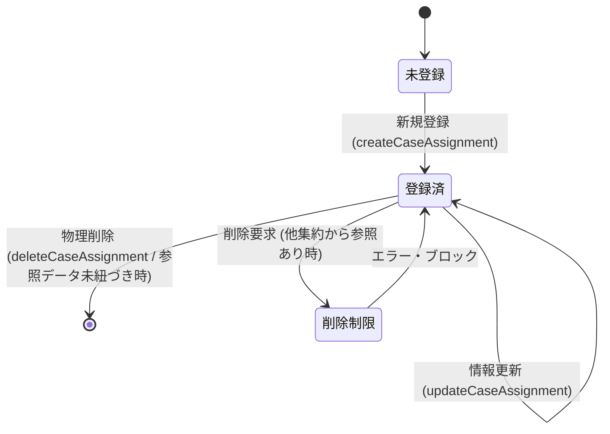

# Data Model: F06 案件作業契約（明細）管理

本ドキュメントは、「F06 案件作業契約（明細）管理」におけるエンティティ構造、制約ルール、および関連するデータ整合性の定義を記述する。

---

## 1. ドメインモデル & 属性 (Domain Model & Attributes)

### 集約ルート (Aggregate Root): `案件作業明細 (CaseAssignment)`
案件に紐づくアサイン契約および金額情報をカプセル化する不変的なドメイン集約。
不変性を保証するため、すべてのプロパティに `readonly` を付与し、生成および変更（複製）はコンストラクタを通じてのみ行う。
本モデルは `projectId` と `id`（作業契約ID）の組み合わせを主キーとする。

| 属性名 (論理) | プロパティ名 (物理) | 型 (TypeScript) | PK / FK | バリデーション & 制約ルール |
| :--- | :--- | :--- | :---: | :--- |
| **プロジェクトID** | `projectId` | `string` | PK, FK | 必須入力。 - すでに登録されている `案件.プロジェクトID` でなければならない。 |
| **作業契約ID** | `id` | `string` | PK | 形式: `WKnnn` - `WK` は固定プレフィックス - `nnn` は `001` から始まる連番。 - プロジェクト単位で個別に採番される。 - 最大 `WK999` まで採番可能。 |
| **案件ID** | `caseId` | `string` | FK | 必須入力。 - すでに登録されている `案件.案件ID` でなければならない。 |
| **開始日** | `startDate` | `string` | - | 必須入力。 - `YYYY-MM-DD` 形式の妥当な日付。 - 紐づく `案件.開始日` 以降、かつ `案件.終了日` 以前でなければならない。 |
| **終了日** | `endDate` | `string` | - | 導出項目 (自動計算)。 - `YYYY-MM-DD` 形式の日付。 - 同一の `projectId` かつ `caseId` のグループ内において、開始日の昇順でソートしたとき： 1. 直後に別の明細が続く場合: `直後の行の開始日の前日`。 2. 最終行の場合: 紐づく `案件.終了日`。 |
| **契約工数** | `contractEffort` | `number` | - | 必須入力。 - `0` より大きい数値（小数点可、単位: 人月）。 |
| **契約単価** | `contractPrice` | `number` | - | 必須入力。 - `0` 以上の整数。 |
| **売上** | `sales` | `number` | - | 導出項目。 - 計算式: `contractEffort` × `contractPrice` （四捨五入して整数）。 |
| **製造原価** | `cost` | `number` | - | 導出項目。 - 計算式: 以下の3つの合計。 1. 当該 `id` に紐づく発注の合計発注額。 2. 当該 `id` に紐づく工数実績の加工費の合計。 3. 当該 `id` に紐づくその他経費の合計金額。 |
| **粗利** | `grossProfit` | `number` | - | 導出項目。 - 計算式: `sales` － `cost`。 |
| **粗利率** | `grossProfitRate` | `number` | - | 導出項目。 - 計算式: `grossProfit` ÷ `sales`（売上が0の場合は `0.00`）。 - 小数点以下第3位を四捨五入し、小数点以下第2位まで保持（例: 0.34）。 |

---

## 2. 状態・ライフサイクルとドメインアクション (Lifecycle Actions)

### 状態遷移図 (State Transition)

### ドメインアクションとビジネスルール
1. **新規作成 (Create)**:
   * 指定された `projectId` および `caseId` の案件が存在することを検証する。
   * 入力された `contractEffort` （> 0）および `contractPrice` （>= 0）を検証する。
   * 指定案件に登録されている他の明細をロードし、追加後のリストについて「開始日に重複がなく、期間の隙間なく案件期間全体を完全にカバーすること」を検証する。
   * リポジトリから、プロジェクトIDに紐づく自動採番された `WKnnn` 形式の新規IDを取得し、インスタンスを構築する。
2. **情報の変更 (Update)**:
   * 既存の作業明細インスタンスから、開始日・工数・単価を変更した**新しい作業明細インスタンスを生成（イミュータブル再構築）**して保存する（親プロジェクトIDおよび案件IDの変更は不可）。
   * 新規作成時と同様の期間隙間なしバリデーションを実行する。
3. **物理削除 (Delete)**:
   * 対象の作業明細（プロジェクトID、作業契約IDのペア）が発注、工数実績、その他経費から参照されているか検証し、存在する場合は削除を拒否し例外をスローする。
   * 参照されていない場合は、LocalStorageおよびメモリ内ストアから対象レコードを物理削除する。
