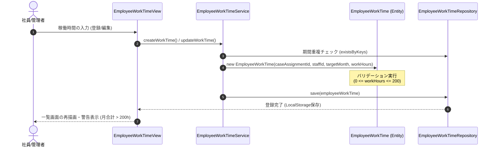

# Domain Data Model: 社員工数実績入力 (employee-worktime-management)

本ドキュメントは、F08「社員工数実績入力」機能で扱われるドメインモデル、一貫性制約、および状態構造を定義したものである。

---

## 1. ドメイン集約 (Domain Aggregates)

### 集約ルート: `EmployeeWorkTime` (月別案件社員工数)
社員の案件（アサイン）ごとの月次稼働時間を表す。
- **データ型**: クラスモデル。イミュータブル（すべての属性が `readonly`）。

#### 属性 (Attributes)
| 属性名 (物理) | 型 (TypeScript) | 制約・バリデーションルール |
| :--- | :--- | :--- |
| `caseAssignmentId` | `string` | 必須。形式検証（`WK`から始まる連番等）。 |
| `staffId` | `string` | 必須。形式検証（`EMP`から始まる連番）。 |
| `targetMonth` | `string` | 必須。`YYYY-MM-01` 形式の日付文字列。 |
| `workHours` | `number` | 必須。`0` 以上 `200` 以下の整数。 |

#### 導出ゲッター (Calculated Properties)
- `laborCost`: 加工費 (`workHours` × `staffPrice`)。
  - 計算式内で必要となる社員の単価（`staffPrice`）は、コンストラクタまたはゲッター呼び出し時にマスタ（`Staff`）から解決して取得・適用する。

---

## 2. 関連する集約 (Related Projections & aggregates)

### `EmployeeWorkTimeSummary` (月別社員工数サマリ)
社員ごとの年月別の合計稼働時間を表す、結果整合性の読み取り専用サマリモデル。
- **データ型**: インターフェース（`src/domain/models/types.ts`）。

#### 属性 (Attributes)
| 属性名 (物理) | 型 (TypeScript) | 説明 |
| :--- | :--- | :--- |
| `staffId` | `string` | 社員ID。 |
| `targetMonth` | `string` | 対象年月 (YYYY-MM-01形式)。 |
| `totalWorkHours` | `number` | 対象社員・月における全工数実績（`EmployeeWorkTime.workHours`）の合計値。 |

---

## 3. 一貫性バリデーションルール

### 1. アサイン期間内チェック (FR-004)
登録する工数実績の `targetMonth`（年月）は、該当 `caseAssignmentId` に紐づく案件アサイン契約の `startDate` 〜 `endDate` 期間内、あるいは月内に期間が1日でも被っている（部分的に重なっている）必要がある。
- **チェック式**:
  月初日 `targetMonth` (YYYY-MM-01) と、月末日 `endOfMonth` (YYYY-MM-lastDay) を算出する。
  `startOfMonth <= assignment.endDate && endOfMonth >= assignment.startDate`
  この条件を満たさない場合は、「選択された年月は作業契約の対象期間外です。」としてエラーを投げる。

### 2. 稼働時間範囲チェック (FR-003)
個別アサインにおける作業実績時間 `workHours` は、`0` 以上 `200` 以下の整数値でなければならない。
- 違反した場合は、「作業時間は0時間以上200時間以下の範囲で入力してください。」としてエラーを投げる。

---

## 4. 状態遷移とデータフロー (Mermaid)

